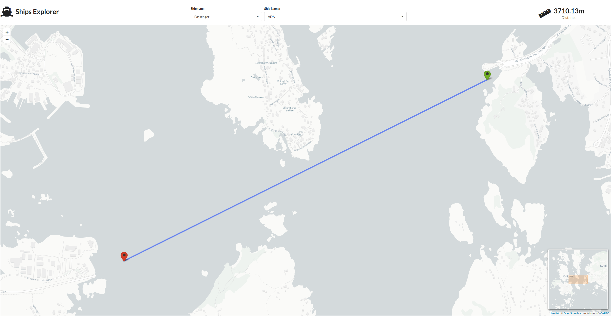

# Ships Explorer

Ships Explorer is a shiny app that visualizes the longest travelled distance between two consecutive observations. The app is available on shinyapps under the following [link](https://ryszard-szymaski.shinyapps.io/shipsexplorer/).





## Setup

This project makes use of renv in order to export use dependencies and rsconnect for deployment. When opening the project R should automatically download the specified version of renv. Next in order to restore the used packages just run:

```r
renv::restore()
```

The whole ships data is too large to store in the repository, therefore a sample was included in `data/ships-sample.csv`. To start the app with the sample data just run:
```r
Sys.setenv(R_CONFIG_ACTIVE = "test")
shiny::runApp()
```